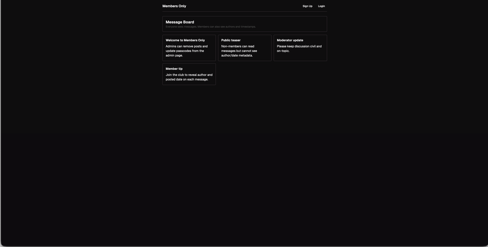

# Members Only



Public message board for [The Odin Project](https://www.theodinproject.com/).

[Source Repository](https://github.com/ChiefWoods/members-only)

## Features

- Write notes on a public message board
- Join as a member to unlock exclusive access

## Built With

### Tech Stack

- [](https://react.dev/)
- [](https://reactrouter.com/)
- [](https://www.prisma.io/)
- [](https://ui.shadcn.com/)
- [](https://vitest.dev)
- [](https://www.docker.com/)

## Getting Started

### Prerequisites

Update your Bun toolkit to the latest version.

```bash
bun upgrade
```

### Setup

1. Clone the repository

```bash
git clone https://github.com/ChiefWoods/members-only.git
```

2. Install all dependencies

```bash
bun install
```

3. Create env file

```bash
cp .env.example .env.development
```

4. Start local Postgres (dev)

```bash
bun run docker:db:up
```

5. Apply migrations

```bash
bun run db:migrate
```

6. Seed initial data (optional but recommended for first run)

```bash
bun run db:seed
```

7. Start development server

```bash
bun run dev
```

8. Build project

```bash
bun run build
```

9. Preview build

```bash
bun run start
```

### Testing

1. Create env file

```bash
cp .env.example .env.test
```

2. Start local Postgres (test)

```bash
bun run docker:test-db:up
```

3. Test project

```bash
bun run test
```

## Issues

View the [open issues](https://github.com/ChiefWoods/members-only/issues) for a full list of proposed features and known bugs.

## Acknowledgements

### Resources

- [Shields.io](https://shields.io/)
- [Lucide](https://lucide.dev/)

### Hosting

- [Railway](https://railway.com/)

## Contact

[chii.yuen@hotmail.com](mailto:chii.yuen@hotmail.com)
